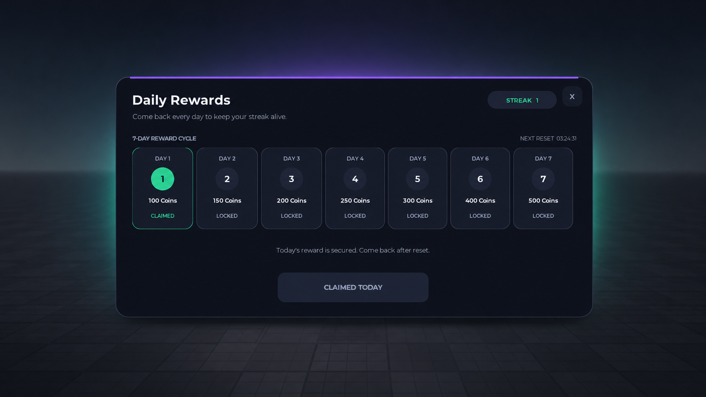

  

# RewardFlow for Roblox

Secure, server-authoritative daily rewards and streak system for Roblox experiences.

RewardFlow is built for developers who need more than a client-controlled login reward script. Eligibility, reward periods, cycle position, streak state, claim identity, persistence, and delivery targets are derived and validated by the server.

> This repository is the public product page and documentation overview. The commercial source code is delivered only to licensed customers.

## Live demo

Test the complete seven-day interface and persistent demo-coin flow in the public Roblox experience:

**[Play RewardFlow — Daily Rewards Demo](https://www.roblox.com/games/75251555760984/RewardFlow-Daily-Rewards-Demo)**

The default demonstration grants persistent coins through `leaderstats.Coins`. Rejoining preserves the claim state and prevents the same daily claim from being granted twice.

## Core features

- Configurable seven-day reward cycle
- Configurable UTC reset hour
- Streak progression, missed-day reset, and cycle wrap
- Responsive desktop and mobile interface
- Server-authoritative eligibility and claim validation
- Versioned DataStore persistence
- Session locking and clean release on leave or shutdown
- Serialized per-player operations with bounded retries
- Crash-recoverable pending delivery
- Deterministic claim IDs for idempotent economy integration
- Per-player request rate limiting
- Duplicate and overlapping-claim protection
- Sanitized client/server responses
- Demo coin economy included
- Production handlers for coins, items, pets, boosts, inventory, and custom rewards
- No external runtime modules or remote asset loaders

## Security model

The public claim endpoint accepts no client arguments. The client does not supply or decide the reward amount, player ID, time, period, streak, cycle index, or claim ID.

RewardFlow derives claim authority on the server, persists the claim before delivery, and supplies a deterministic `claimId` to the configured reward handler. A correctly integrated economy can use that identifier to recognize crash retries without granting the same reward twice.

## Default demo cycle

| Day | Reward |
| ---: | ---: |
| 1 | 100 Coins |
| 2 | 150 Coins |
| 3 | 200 Coins |
| 4 | 250 Coins |
| 5 | 300 Coins |
| 6 | 400 Coins |
| 7 | 500 Coins |

Every reward definition and the UTC reset hour can be changed through the included configuration modules.

## Included with purchase

- Guided drag-and-drop `.rbxmx` Studio model
- Full Luau source code
- Rojo 7.7.x project
- Standalone Roblox Studio demo place
- Installation and production checklist
- Public API documentation
- Reward-handler integration guide
- Client/server network-boundary documentation
- UI customization guide
- Commercial-use license

## Installation options

### Roblox Studio model

Open the included model and move the three numbered installer folders to `ReplicatedStorage`, `ServerScriptService`, and `StarterPlayerScripts` as documented in the package.

### Rojo

Serve the included `Source/default.project.json` file with Rojo 7.7.x and sync it into the target experience.

## Production integration requirement

The included demo economy works immediately after installation. For a production game, disable the demo reward handler and connect every configured reward definition to the game's real server-side economy.

Custom handlers must durably recognize the deterministic `claimId` supplied by RewardFlow. This requirement is what makes reward delivery safe across server interruptions and retries; RewardFlow cannot make unrelated economy code idempotent automatically.

## Validation

RewardFlow v1.0.0 was validated in Roblox Studio with:

- Seven automated test suites covering reward rules, persistence, daily progression, handlers, networking, UI, and demo delivery
- Immediate reconnect persistence
- Duplicate-claim rejection
- Durable demo-reward delivery
- Invalid network-request handling
- Responsive desktop and mobile layouts
- Two-player state independence
- Clean installation in a separately published experience
- End-to-end customer ZIP download and installation verification

## Commercial license

One purchase licenses the purchasing individual or company to use and modify RewardFlow across its own controlled Roblox experiences, including completed client projects.

Redistribution, resale, sublicensing, source sharing, public uploading, or publishing RewardFlow as a competing standalone asset is prohibited. The complete controlling license is included with the purchased package.

## Purchase

**[Get RewardFlow on Gumroad](https://obsessioncreator.gumroad.com/l/rewardflow-daily-rewards)**

The downloadable package includes the Studio model, full source, Rojo project, demo place, documentation, and commercial-use license.

## Support

Support covers reproducible RewardFlow defects and clarification of the included documentation. Custom game development, economy architecture, installation services, and UI redesign are not included unless separately agreed.

Never send passwords, authentication cookies, API keys, recovery codes, or private credentials when requesting support.

## Platform notice

Roblox is a trademark of Roblox Corporation. RewardFlow is an independent third-party development product and is not affiliated with, sponsored by, or endorsed by Roblox Corporation.

Copyright © 2026 obsession_creator. All rights reserved.
